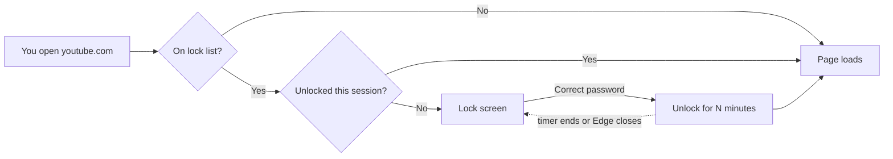

<p align="center"></p>

<h1 align="center">Site Lock</h1>

**Password-protect any website in Microsoft Edge.**

Pick the sites you want to guard, set one master password, and Site Lock shows a password screen whenever someone opens those sites. It is built on Manifest V3 and runs entirely on your machine: no account, no server, no tracking.

---

## ✨ Features

| | |
|---|---|
| 🛡️ **Blocks before loading** | Locked sites never render. Navigation is redirected to the lock screen at the network level, so there is no flash of content. |
| 🌐 **Covers subdomains** | Locking `youtube.com` also locks `www.youtube.com`, `m.youtube.com`, and so on. |
| ⏱️ **Auto re-lock** | An unlocked site locks itself again after 5, 15, 30 (default) or 60 minutes, or when the browser closes. |
| 🔁 **Locks on restart** | Every unlock is forgotten when Edge closes. |
| 📑 **Locks open tabs too** | When you lock a site or its timer runs out, any tab already showing it switches to the lock screen. |
| ⚡ **One-click lock** | Lock the site you are on from the toolbar popup, or lock everything at once with **Lock all now**. |
| 🔑 **Protected settings** | Removing a site, changing the re-lock timer or changing the password all need the current password. |
| 🧂 **Hashed password** | The password is never stored. Only a salted PBKDF2-SHA256 hash (200,000 iterations) is kept. |
| 🌗 **Light and dark mode** | Follows your system theme. |

---

## 🚀 Install in Microsoft Edge

Site Lock is not on the Edge Add-ons store, so you load it from this folder.

1. **Get the code**
   ```bash
   git clone https://github.com/Sandeep2k5/site-lock.git
   ```
2. Open **`edge://extensions`** in Edge.
3. Turn on **Developer mode** (toggle in the left sidebar, or at the bottom left on narrow windows).
4. Click **Load unpacked** and choose the `site-lock` folder.
5. Click the **Extensions** (puzzle-piece) icon in the toolbar, then the 👁️ eye icon next to **Site Lock** to pin it.

> **Note:** Edge may show a banner about developer-mode extensions when it starts. Dismiss it; the extension keeps working.

> Works in Chrome, Brave and other Chromium browsers too. Use `chrome://extensions` there.

---

## 🧭 How to use

### 1. Create your password
Click the Site Lock icon. The first time, it asks you to create a master password (at least 4 characters).

### 2. Lock a site
- **Current site:** open the site, click the Site Lock icon, then **Lock this site**.
- **Any site:** click **Manage sites**, enter your password, type a domain such as `reddit.com`, then click **Add**.

### 3. Open a locked site
Visit it as usual. You see the lock screen. Enter the password and the page you asked for opens.

### 4. Manage
From **Manage sites** (password required) you can:
- remove a site from the lock list
- change how long a site stays unlocked
- change your password

### Popup at a glance

| Popup shows | Meaning | Button |
|---|---|---|
| **Not locked** | This site is not on your list | **Lock this site** |
| **Unlocked until 3:45 PM** | You unlocked it recently | **Lock it again now** |
| **Locked** | It is on your list and locked | — |

---

## ⚙️ How it works



Site Lock uses Edge's [`declarativeNetRequest`](https://developer.chrome.com/docs/extensions/reference/api/declarativeNetRequest) API with two rules:

1. **Lock rule** (dynamic, saved across restarts): redirects top-level visits to any locked domain to `lock.html#<original-url>`.
2. **Unlock rule** (session, cleared when Edge closes): a higher-priority `allow` rule for the domains you have unlocked.

Unlocking adds the domain to the session rule and sets a `chrome.alarms` timer. When the timer fires, the domain is removed and open tabs on it are sent back to the lock screen.

---

## 📁 Project structure

```
site-lock/
├── manifest.json    # Extension config (Manifest V3)
├── background.js    # Service worker: lock/unlock rules, timers, password checks
├── shared.js        # Password hashing and domain helpers
├── lock.html/.js    # Password screen shown in place of a locked site
├── popup.html/.js   # Toolbar popup: setup, quick lock, site management
├── style.css        # Shared styles with light and dark themes
├── icons/           # Toolbar and extension icons (16–128 px)
├── store/           # Store listing assets (300×300 logo)
└── tools/
    ├── make-icons.mjs   # Regenerates the icons: node tools/make-icons.mjs
    └── package.ps1      # Builds dist/site-lock-<version>.zip for the store
```

No build step and no dependencies. Edit a file, then click **Reload** on the Site Lock card in `edge://extensions`.

### Package for Edge Add-ons

```powershell
powershell -ExecutionPolicy Bypass -File tools/package.ps1
```

This writes `dist/site-lock-<version>.zip` with `manifest.json` at the root, ready to upload in Partner Center. Bump `version` in `manifest.json` before each new submission.

---

## 🔐 Permissions

| Permission | Why it is needed |
|---|---|
| `declarativeNetRequest` | Redirect locked sites to the lock screen before they load |
| `storage` | Save your site list, settings and password hash |
| `alarms` | Re-lock sites when their unlock timer ends |
| Access to all sites | Needed for redirects, and to lock tabs that are already open |

All data stays in your browser's local extension storage. Nothing is sent anywhere. See [PRIVACY.md](PRIVACY.md).

---

## ⚠️ Limitations

Site Lock is a **privacy and self-control tool, not a security boundary**.

- Anyone with access to your Windows account can turn the extension off in `edge://extensions`.
- It does not lock InPrivate windows unless you enable **Allow in InPrivate** on the extension's details page.
- If you forget your password, remove and reinstall the extension. This deletes your site list as well.

---

## 🛠️ Tech

Vanilla JavaScript (ES modules) · Manifest V3 · `declarativeNetRequest` · Web Crypto API (PBKDF2) · No frameworks, no dependencies

---

<sub>Built by **Sandeep Uthayakumar**.</sub>
