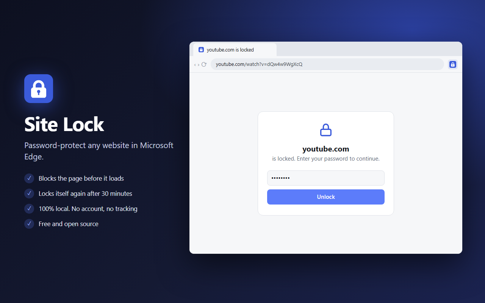
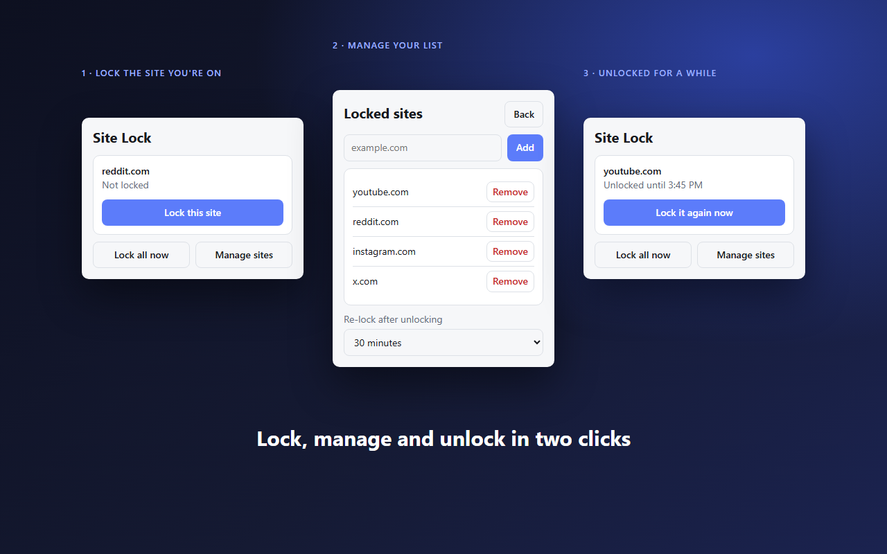
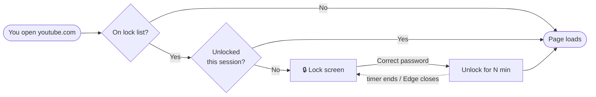

<div align="center">


# Site Lock

### Put a password on any website.

A tiny, private browser extension for **Microsoft Edge** that locks the sites you choose behind a password.<br>
No account. No servers. No tracking. Just a lock.

[](#-install-in-30-seconds)
[](https://learn.microsoft.com/en-us/microsoft-edge/extensions/)
[](LICENSE)
[](#-under-the-hood)

[**⬇️ Download**](https://github.com/Sandeep2k5/site-lock/releases/latest) · [**Install**](#-install-in-30-seconds) · [**How it works**](#-under-the-hood) · [**Privacy**](PRIVACY.md)

<br>



</div>

<br>

## 🤔 Why?

Sometimes you want a little friction between you and a website, or a little privacy on a shared computer.

- 🎯 **Stay focused:** lock YouTube, Reddit or X during work, and unlocking becomes a conscious choice.
- 👨‍👩‍👧 **Shared PC:** keep your email, banking or chats out of sight when someone else uses the computer.
- 🙈 **Peace of mind:** a page you've locked never shows up on screen by accident.

<br>

## ✨ Features

<table>
<tr>
<td width="50%" valign="top">

### 🛡️ Blocks before it loads
Locked sites are redirected at the network level, so the page never appears on screen, even for a moment.

### ⏱️ Re-locks itself
Unlocked sites lock again after **5 / 15 / 30 / 60 minutes**, or when you close Edge. You choose.

### 🌐 Covers subdomains
Lock `youtube.com` and `m.youtube.com`, `music.youtube.com` and the rest are locked too.

</td>
<td width="50%" valign="top">

### 📑 Locks open tabs
Lock a site and every tab already showing it switches to the lock screen straight away.

### 🔑 Settings need the password
Removing a site, changing the timer or changing the password all ask for the current password.

### 🧂 Never stores your password
Only a salted **PBKDF2-SHA256** hash (200,000 rounds) is saved, and it stays on your device.

</td>
</tr>
</table>

<div align="center">

</div>

<br>

## 🚀 Install in 30 seconds

> Site Lock isn't on the Edge Add-ons store yet, so it's installed manually. It takes four clicks.

1. **Download** `site-lock-*.zip` from the [latest release](https://github.com/Sandeep2k5/site-lock/releases/latest) and **extract** it to a folder you'll keep.
2. Open **`edge://extensions`**.
3. Turn on **Developer mode** (left sidebar).
4. Click **Load unpacked** and select the extracted folder.

Then click the 🧩 icon in the toolbar and pin **Site Lock** so it's always visible.

<details>
<summary><b>Using Chrome, Brave, Opera or another Chromium browser?</b></summary>
<br>
Same steps. Open <code>chrome://extensions</code> (or your browser's equivalent) instead of <code>edge://extensions</code>.
</details>

<details>
<summary><b>Edge shows a warning about developer-mode extensions</b></summary>
<br>
That's normal for extensions installed outside the store. Close the warning; Site Lock keeps working.
</details>

<br>

## 🧭 Usage

| Step | What to do |
|:---:|---|
| **1** | Click the Site Lock icon and **create a password**. |
| **2** | Open a site you want to lock, click the icon, then **Lock this site**. |
| **3** | Next time you open it, you'll see the lock screen. Enter the password to continue. |
| **4** | Use **Manage sites** to add or remove sites, change the re-lock timer or change your password. |
| **⚡** | **Lock all now** locks every unlocked site straight away. |

<br>

## ⚙️ Under the hood



Site Lock is built on the [`declarativeNetRequest`](https://developer.chrome.com/docs/extensions/reference/api/declarativeNetRequest) API with just **two rules**:

| Rule | Type | Does |
|---|---|---|
| 🔒 **Lock** | Dynamic (survives restarts) | Redirects top-level visits to locked domains → `lock.html#<original-url>` |
| 🔓 **Unlock** | Session (wiped when Edge closes) | Higher-priority `allow` for domains you've just unlocked |

When you unlock, the domain joins the session rule and a `chrome.alarms` timer starts. When it fires, the domain is removed and any open tabs of it go back to the lock screen.

<details>
<summary><b>📁 Project structure</b></summary>

```
site-lock/
├── manifest.json        Extension config (Manifest V3)
├── background.js        Service worker: rules, timers, password checks
├── shared.js            Password hashing + domain helpers
├── lock.html / lock.js  The lock screen
├── popup.html / popup.js  Toolbar popup
├── style.css            Shared styles, light + dark
├── icons/               16–128 px icons
├── store/               Store listing assets
├── docs/                README images
└── tools/
    ├── make-icons.mjs   node tools/make-icons.mjs → regenerates icons
    └── package.ps1      Builds dist/site-lock-<version>.zip
```

No build step. Edit a file, then hit **Reload** on the Site Lock card in `edge://extensions`.

</details>

<details>
<summary><b>🔐 Permissions explained</b></summary>
<br>

| Permission | Why |
|---|---|
| `declarativeNetRequest` | Redirect locked sites to the lock screen before they load |
| `storage` | Save your site list, settings and password hash |
| `alarms` | Re-lock sites when their timer ends |
| Access to all sites | Needed for the redirect, and to lock tabs that are already open |

Everything stays in your browser's local extension storage. Nothing is ever sent anywhere. Read the [privacy policy](PRIVACY.md).

</details>

<br>

## ⚠️ Good to know

Site Lock is a **focus and privacy tool, not a vault**.

- Anyone who can use your Windows account can turn the extension off in `edge://extensions`.
- To lock sites in **InPrivate** windows too, open the extension's **Details** page and turn on **Allow in InPrivate**.
- **Forgot your password?** Remove and re-add the extension. Your site list resets too.

<br>

## 🗺️ Roadmap

- [ ] Publish on Microsoft Edge Add-ons
- [ ] Scheduled locks (e.g. lock social media 9am–5pm)
- [ ] A different password for each site
- [ ] Lock specific pages, not just whole domains

Have an idea? [Open an issue](https://github.com/Sandeep2k5/site-lock/issues).

<br>

## 🤝 Contributing

Bug reports, ideas and pull requests are welcome.

1. Fork the repo and create a branch
2. Load it unpacked in Edge and make your change
3. Open a pull request describing what changed and how you tested it

<br>

<div align="center">

**If Site Lock helps you, a ⭐ on the repo helps other people find it.**

Made by [**Sandeep Uthayakumar**](https://github.com/Sandeep2k5) · [MIT License](LICENSE)

</div>
